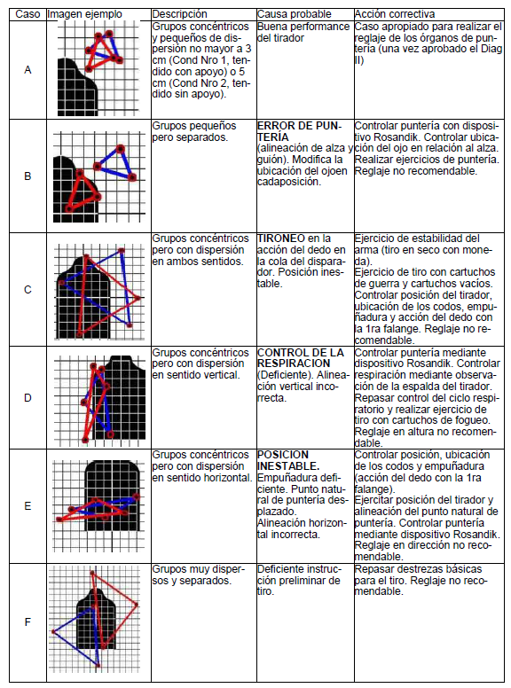
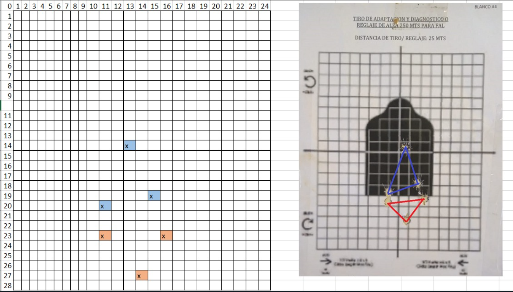
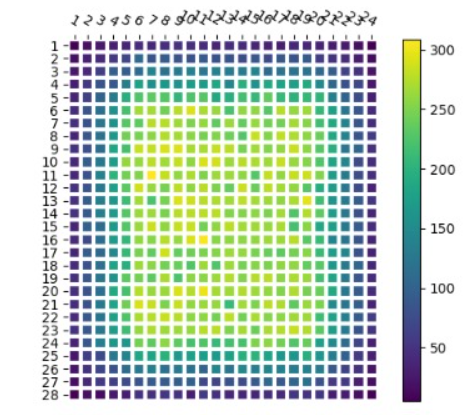
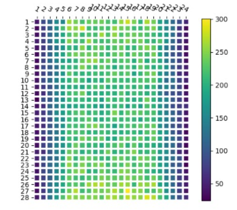
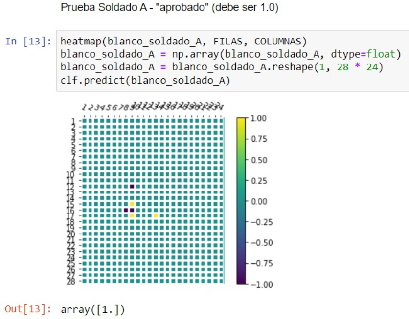
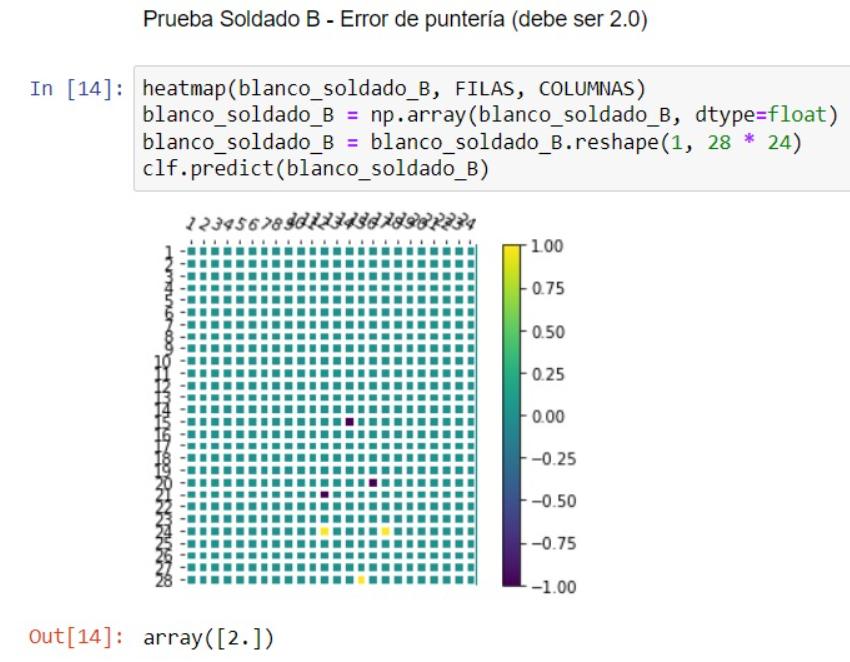

# Aplicación de Redes Neuronales Artificiales
# Análisis de grupos de Impactos del Diagnóstico del Método Optimizado de Tiro Escuela del Ejército Argentino

##Resumen:
En el marco de la cátedra de Inteligencia Artificial, correspondiente a la carrera de Ingeniería en Informática de la Facultad de Ingeniería del Ejército, perteneciente a la Universidad de la Defensa, se propone la resolución de un problema de clasificación, utilizando la metodología de Redes Neuronales Artificiales. El problema a resolver consiste en clasificar las series de impactos resultantes de la ejecución de la condición de tiro denominada "Diagnóstico 1" del Método Optimizado de Tiro Escuela (MOTE) del Ejército Argentino (EA).

## Autores:
Version 1.0:
* *Cabrera, Ezequiel*
* *Maceira, Carlos*
* *Salazar, Nahuel*

Version 2.0:
* *Delcourt, Javier*
* *Pavón, Francisco*
* *Patricelli, Horacio*
* *Schamberger, Edith*

##Introducción:
Luego de su incorporación al EA todo el personal es instruido en el empleo de armas de fuego. Parte de esa instrucción es la ejecución de las condiciones establecidas en el MOTE, siendo la de Diagnóstico 1 la primera de ellas, ya que permite indentificar quienes aplican correctamente los conceptos y accionan correctamente el arma, y quienes están cometiendo algún error. En este segundo caso, se puede identificar qué error se está cometiendo, para poder corregirlo y mejorar el desempeño del tirador. Para ello existen 6 casos.

El objetivo de este trabajo es utilizar las redes neuronales artificiales para resolver el problema de clasificación. El problema a resolver consiste en clasificar las dos series de impactos de los disparos, inicialmente en 6 grupos: los aprobados y los desaprobados. El segundo de ellos, a su vez se divide en errores de puntería, tironeo de la cola del disparador, control de la respiración, posición inestable y deficiente instrucción.

##Metodología:
Para la resolución del problema se utilizaron las siguientes herramientas:
* Python 3.9
* Jupyter Notebook 6.4.3
* Pandas 1.3.3 
* Numpy 1.21.2
* Matplotlib 3.4.3
* Scikit-learn 1.1.1
* tqdm 4.62.3

En primer lugar, debido a la gran cantidad de datos necesarios para entrenar la red neuronal se crea el algoritmo para la generación de blancos que cumplan con las exigencias de cada caso.

Luego se procede a entrenar la red y comprobar la eficiencia de la misma de dos maneras: 
- Identificando 100 blancos generados por el algoritmo de entrenamiento 
- Clasificando los resultados de distribuciones de impactos obtenidas de sesiones reales de tiro del personal del Regimiento de Granaderos a Caballo ¨General San Martín¨.

Ejemplo de blanco real.

##Código:
El código utilizado para resolver el problema se encuentra en el archivo ia_perceptron.py, donde se implementan las clases, métodos y funciones necesarias para generar los blancos, entrenar el algoritmo MLPClassifier y luego clasificar los resultados. 

Actualmente se encuentra en proceso de revision y mejora, sin embargo ya posee una precisión superior al 80%.

##Resultados:
Los resultados obtenidos hasta el momento son los siguientes:

- Distribución de impactos de 20000 blancos generados, caso A (aprobado):

- Distribución de impactos de 20000 blancos generados, caso D (desaprobado por control de la respiración):

- Prueba de clasificación del blanco correspondiente al soldado A:

- Prueba de clasificación del blanco correspondiente al soldado B:

##Propuesta:
Se propone continuar con el desarrollo del proyecto, para lo cual se plantean las siguientes tareas:
* Mejorar el algoritmo de generación de blancos, para que sea más eficiente.
* Implementar otro algoritmo de clasificación para realizar un análisis comparativo con el actual.
* Implementar un algoritmo de computer vision para extraer los impactos de los blancos reales.